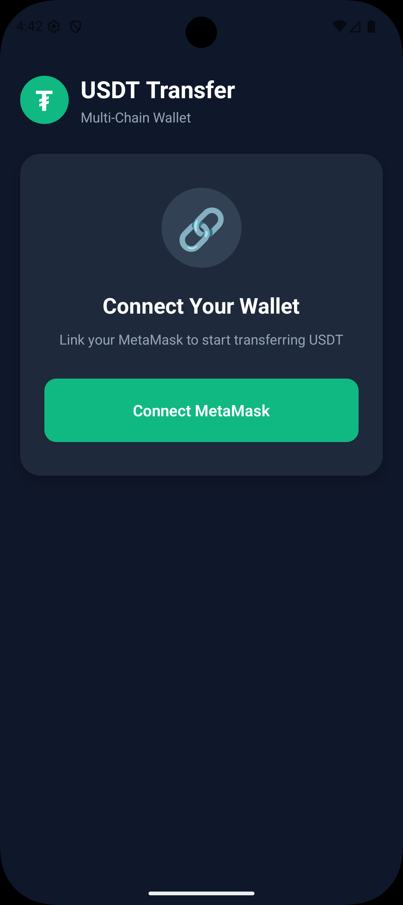
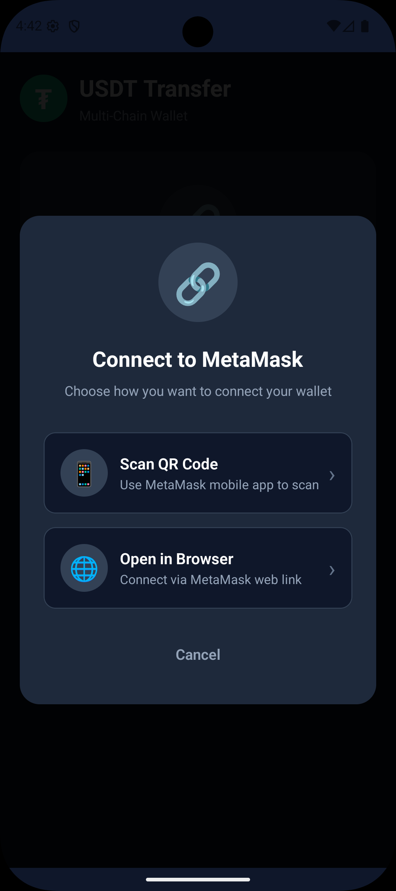
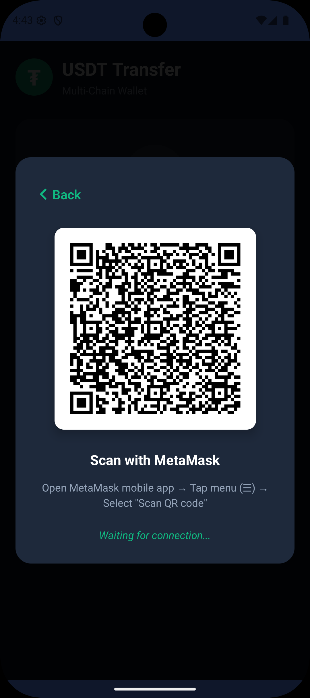
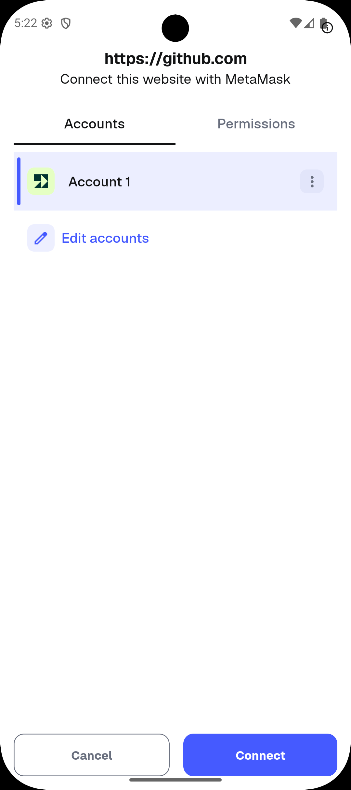
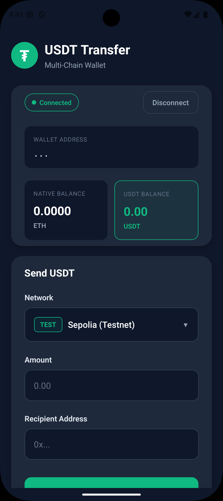

# USDT Transfer - Multi-Chain Wallet App

A React Native mobile application for transferring USDT (Tether) across multiple blockchain networks using MetaMask wallet integration via WalletConnect.

## Screenshots

### App Flow

<p align="center">
  
  
  
  
</p>

| Connect Screen | Connection Options | QR Code | MetaMask Approval |
|:--------------:|:------------------:|:-------:|:-----------------:|
| Initial screen with connect button | Choose QR or browser link | Scan with MetaMask | Approve connection in MetaMask |

### Connected State

<p align="center">
  
</p>

| Connected Wallet |
|:----------------:|
| View balances, wallet info & send USDT form |

## Features

- **Multi-Chain Support**: Transfer USDT on multiple networks
  - Ethereum Mainnet
  - Polygon (MATIC)
  - BNB Smart Chain
  - Sepolia Testnet (for testing)

- **MetaMask Integration**: Secure wallet connection via WalletConnect v2
  - QR Code scanning
  - Deep link support
  - Session persistence

- **Real-time Balances**: View native token and USDT balances

- **Transaction Management**:
  - Send USDT to any wallet address
  - Transaction status tracking
  - Block explorer links

- **Responsive Design**: Adaptive UI for all screen sizes

## Tech Stack

- **React Native** 0.83.1
- **TypeScript**
- **Ethers.js** v6 - Ethereum library
- **WalletConnect** v2 - Wallet connection protocol
- **React Native SVG** - Vector graphics
- **React Native QRCode SVG** - QR code generation

## Prerequisites

- Node.js >= 20
- npm or yarn
- React Native CLI
- Android Studio (for Android development)
- Xcode (for iOS development, macOS only)
- MetaMask mobile app installed on your device

## Installation

1. **Clone the repository**
   ```bash
   git clone <repository-url>
   cd MetaMaskUSDTApp
   ```

2. **Install dependencies**
   ```bash
   npm install
   ```

3. **Install iOS pods** (macOS only)
   ```bash
   cd ios && pod install && cd ..
   ```

4. **Configure WalletConnect**

   Create/update the WalletConnect configuration in `src/config/walletConnect.ts`:
   ```typescript
   export const WALLET_CONNECT_PROJECT_ID = 'your-project-id';
   ```

   Get your project ID from [WalletConnect Cloud](https://cloud.walletconnect.com/)

## Running the App

### Android

```bash
# Start Metro bundler
npm start

# In a new terminal, run on Android
npm run android
```

### iOS (macOS only)

```bash
# Start Metro bundler
npm start

# In a new terminal, run on iOS
npm run ios
```

## Project Structure

```
MetaMaskUSDTApp/
├── src/
│   ├── assets/              # Images and screenshots
│   ├── components/          # Reusable UI components
│   │   ├── Button.tsx
│   │   ├── Input.tsx
│   │   ├── NetworkSelector.tsx
│   │   ├── QRCodeModal.tsx
│   │   └── StatusModal.tsx
│   ├── config/              # App configuration
│   │   ├── networks.ts      # Network configurations
│   │   └── walletConnect.ts # WalletConnect setup
│   ├── contexts/            # React contexts
│   │   └── WalletConnectContext.tsx
│   ├── hooks/               # Custom React hooks
│   │   ├── index.ts
│   │   └── useResponsive.ts
│   ├── screens/             # App screens
│   │   └── HomeScreen.tsx
│   ├── services/            # Business logic
│   │   ├── transactionService.ts
│   │   └── walletService.ts
│   └── types/               # TypeScript definitions
│       └── index.ts
├── android/                 # Android native code
├── ios/                     # iOS native code
└── package.json
```

## Usage Guide

### Connecting Your Wallet

1. Open the app and tap **"Connect MetaMask"**
2. Choose connection method:
   - **Scan QR Code**: Open MetaMask app → Menu (☰) → Scan QR code
   - **Open in Browser**: Opens MetaMask via deep link
3. Approve the connection request in MetaMask

### Sending USDT

1. Ensure your wallet is connected
2. Select the network (Ethereum, Polygon, BNB, or Sepolia Testnet)
3. Enter the amount of USDT to send
4. Enter the recipient's wallet address
5. Tap **"Send USDT"**
6. Approve the transaction in MetaMask
7. Wait for confirmation

## Supported Networks

| Network | Chain ID | Native Token | USDT Contract |
|---------|----------|--------------|---------------|
| Ethereum | 1 | ETH | 0xdAC17F958D2ee523a2206206994597C13D831ec7 |
| Polygon | 137 | MATIC | 0xc2132D05D31c914a87C6611C10748AEb04B58e8F |
| BNB Smart Chain | 56 | BNB | 0x55d398326f99059fF775485246999027B3197955 |
| Sepolia (Testnet) | 11155111 | ETH | 0xaA8E23Fb1079EA71e0a56F48a2aA51851D8433D0 |

## Testing on Testnet

For testing without real funds:

1. Select **"Sepolia (Testnet)"** from the network dropdown
2. Get free Sepolia ETH from faucets:
   - https://sepoliafaucet.com
   - https://www.alchemy.com/faucets/ethereum-sepolia
3. Get test USDT from Aave faucet:
   - https://staging.aave.com (connect wallet, switch to Sepolia)

## Troubleshooting

### Common Issues

**"Provider not initialized"**
- Wait for the app to fully load before connecting

**"Insufficient balance"**
- Ensure you have enough native tokens (ETH/MATIC/BNB) for gas fees
- Ensure you have USDT balance on the selected network

**Connection not working**
- Make sure MetaMask mobile app is installed and updated
- Check your internet connection
- Try disconnecting and reconnecting

**QR Code not appearing**
- Restart the app
- Check WalletConnect project ID configuration

**Metro cache issues**
```bash
npm start -- --reset-cache
```

**Build issues**
```bash
# iOS
cd ios && pod install && cd ..

# Android
cd android && ./gradlew clean && cd ..
```

## Security Notes

- Never share your private keys or seed phrase
- Always verify transaction details before approving
- Use testnets for testing purposes
- The app does not store private keys - all signing happens in MetaMask

## Dependencies

```json
{
  "ethers": "^6.16.0",
  "@walletconnect/modal-react-native": "^1.1.0",
  "@walletconnect/react-native-compat": "^2.23.1",
  "react-native-qrcode-svg": "^6.2.0",
  "react-native-svg": "^15.15.1",
  "@react-native-async-storage/async-storage": "^1.24.0"
}

---

**React Native Developer Assignment - December 2025**

Built with React Native and WalletConnect
